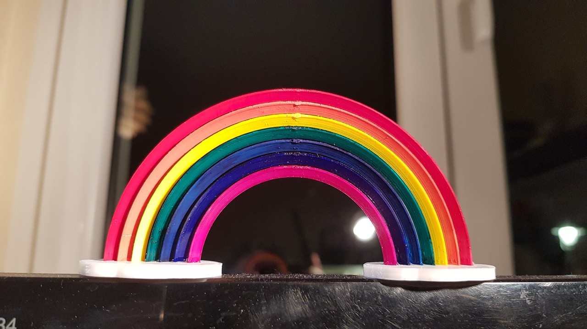
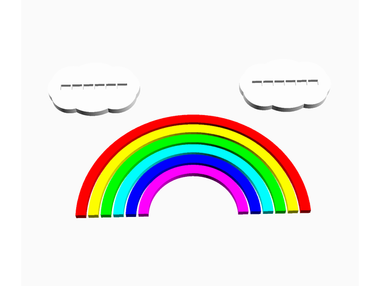
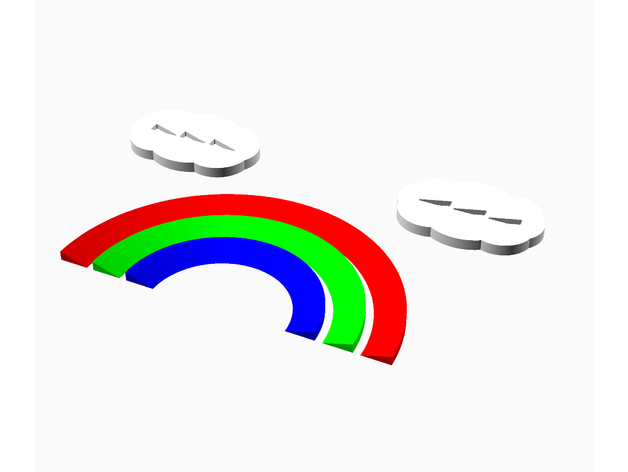
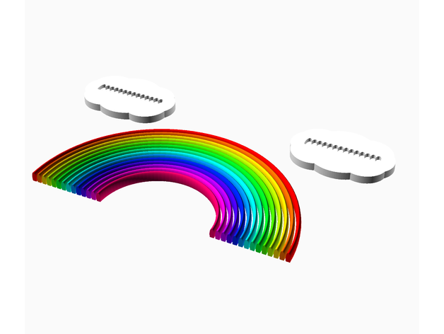
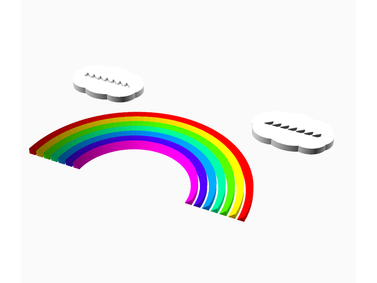
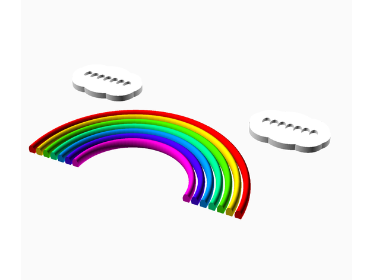

# The Rainbow Customizer (09 June 2021)
by ioio72 aka Tamio Patrick Honma

## Description

You can adjust the size, the number of colors, angle and many other properties of the rainbow.

You can export different sets of parts, which allows you to decide whether to paint the rainbow or use filament colors.

Have fun and enjoy the diverse colors of our world!

LGBT: 

Mario Kart Live tunnel: 

Angles: 

Colors: 

Shapes: 

**Possible Uses**

* Prop for modeled landscapes and sculptures
* Mario Kart Live Rainbow Tunnel
* LGBT sign
* Decoration
* The sky is the limit

## Use OpenSCAD

1. **Download and install:** [OpenSCAD](http://openscad.org/) version 2021.01 or newer
2. **Download:** The *.scad file of this model.
3. **Start** OpenSCAD and **open** the *.scad file in it.
4. **Open the customizer** via the menu "Window/Customizer"

Now you can configure the model and use the `F5` key to render the preview of your changes.

### Export your STL file

If you're done with your model settings, you can export the STL file:

1. Render the mesh by pressing the `F6` key.
2. Wait until the rendering is finished. This might take some minutes.
3. Export the STL file by pressing the `F7` key.

### Optionally save your configuration

If you like to use your configuration as a template for further models, it's a good idea, to save your configuration:

1. Click the `+` symbol in the customizer, which you find beside the configuration selector drop-down in the second line of the customizer.
2. Give your configuration a name.

Use the drop-down menu to access your saved configurations.

## Post printing

**Glue Rainbow to stand**

I recommend to use superglue to attach the rainbow segments to the stand.

If the bows don't fit into the holes, you can increase the stand attachment hole tolerance value

